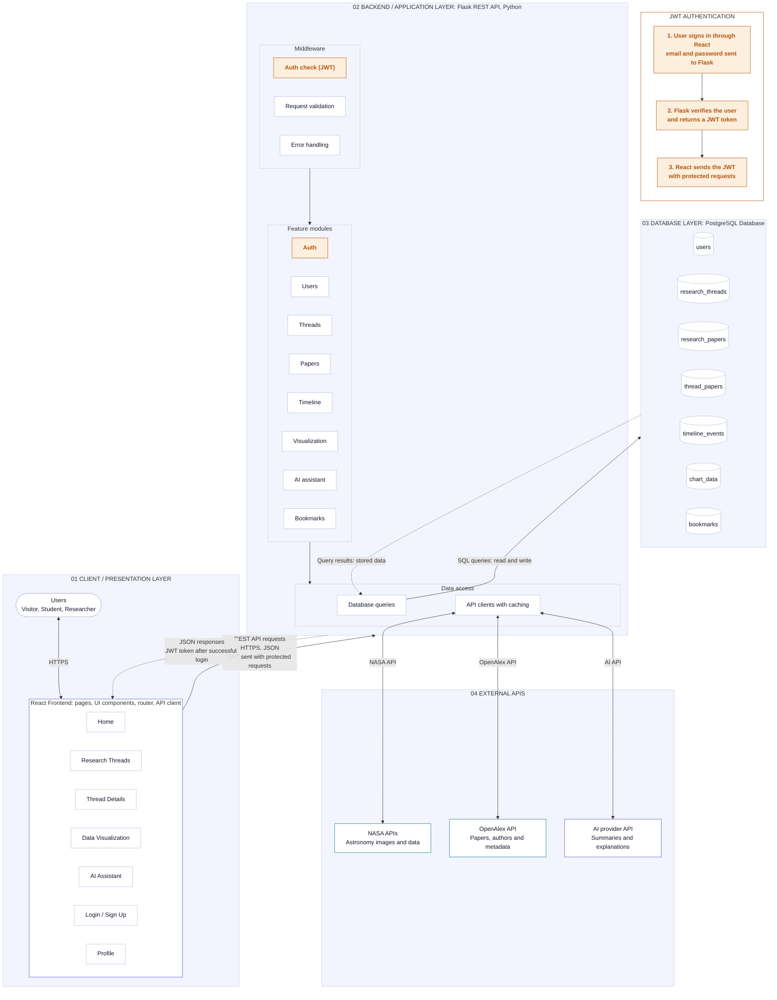
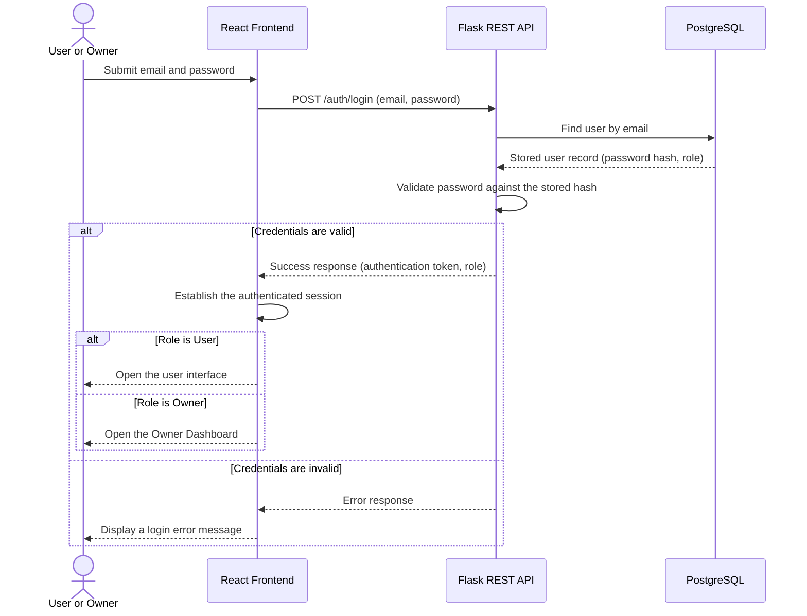
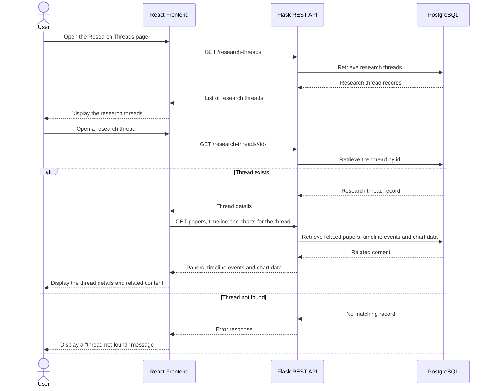
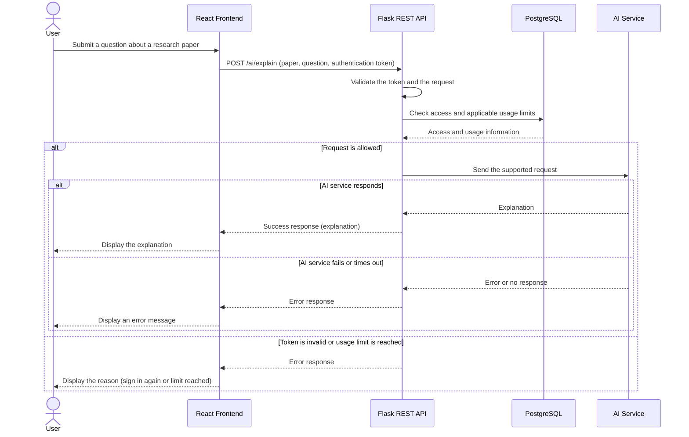

# AstroThread — Technical Documentation

## 1. Define User Stories and Mockups

AstroThread is a website for exploring astronomy and physics research through connected research threads. The user stories below are prioritized using the MoSCoW method. Must and Should stories define the MVP scope.

### 1.1 User Stories

| Priority | User Type | Story |
| --- | --- | --- |
| Must | Visitor | I want to register and log in, so that my bookmarks and profile are saved. |
| Must | User | I want to browse and search research threads, so that I can explore scientific topics in an organized way. |
| Must | User | I want to open a thread and see its overview and related papers, so that I can follow a topic from its origin to recent work. |
| Must | User | I want to view a timeline of discoveries, so that I can understand how a scientific idea developed over time. |
| Must | User | I want to see astronomy images and data from NASA linked to a topic, so that the content feels concrete. |
| Must | User | I want to explore scientific data through interactive charts, so that I can understand it visually. |
| Must | User | I want to ask an AI assistant about a research paper, so that I can understand complex scientific information more easily. |
| Should | User | I want to bookmark research threads, so that I can return to them later. |
| Should | User | I want to manage my profile and change my password, so that my account stays up to date and secure. |
| Should | Owner | I want to create, edit, and delete research threads, so that I can manage the platform's research content. |
| Could | User | I want to view available subscription plans and upgrade to Premium, so that I can access increased AI usage limits. |

### 1.2 Mockups

The Figma mockups represent the planned user interface for the following pages and sections:

- Home Page.
- Research Threads Page.
- Research Thread Details Page.
- Search Results Page.
- Discovery Timeline.
- NASA Media Section.
- Data Visualization Section.
- AI Research Assistant.
- Login and Registration Pages.
- User Profile.
- Subscription Plans Page.
- Owner Dashboard.

The mockups should reflect the user stories, permissions, and features defined in this document. Features outside the agreed MVP scope will be considered future improvements.

## 2. Design System Architecture

### 2.1 Architecture Overview

AstroThread uses a client-server architecture:

- Frontend: React.
- Backend: Python and Flask REST API.
- Database: PostgreSQL.
- External Services: NASA API, a research metadata API, and an AI service.

The React frontend communicates with the Flask backend through HTTP requests. Flask handles business logic, authentication, authorization, database operations, and communication with external services.

#### System Architecture Diagram

The diagram below shows the planned architecture. It is the same diagram kept in `astrothread-system-architecture.mermaid`; if one copy changes, update the other.

The architecture has four layers:

- **Client / Presentation Layer:** People use the React frontend in a web browser over HTTPS. React holds the pages and UI components, handles routing, and sends every request to the backend through its API client.
- **Backend / Application Layer:** The Flask REST API receives all requests. Each request passes through middleware (authentication check, request validation, error handling), then a feature module, then the data access code. Only the backend reads the database or calls an external API.
- **Database Layer:** PostgreSQL stores users, research threads, research papers, timeline events, chart data and bookmarks. The tables shown match Section 3.2. The optional `subscriptions` table is not shown because subscriptions are not confirmed for the MVP.
- **External APIs:** The backend calls the NASA API for astronomy images and data, a research metadata API for paper information, and an AI service for explanations. These integrations are planned. The diagram names OpenAlex and "AI provider API"; the providers are not final until they are selected and documented (Section 5.2).

The authentication panel shows the order of the token flow: the user signs in with email and password, Flask verifies the user and returns a token, and only after that does React send the token with protected requests. The diagram calls the token a JWT; the token format is to be confirmed during implementation.

### 2.2 Main Components

- React User Interface: Displays pages, forms, research threads, timelines, and visualizations.
- Flask REST API: Handles client requests and application logic.
- Authentication and Authorization: Validates user credentials and enforces role-based access.
- Research Thread Management: Manages research threads and their related content.
- Bookmark Management: Saves and retrieves users' bookmarked threads.
- Subscription Management: Stores subscription plans and status if subscription functionality is included in the MVP.
- AI Research Assistant: Sends supported research questions to an AI service.
- PostgreSQL Database: Stores users, research content, bookmarks, and other application data.
- External API Integration: Retrieves astronomy media, research metadata, and AI-generated explanations.

### 2.3 Authentication and Authorization

Users authenticate through the login page. The backend validates their credentials and issues an authentication token.

The system has two account roles:

- User: Can access research features, manage personal bookmarks and profile information, and view subscription information.
- Owner: Can manage research threads and their related content through protected management endpoints.

A Visitor is an unauthenticated person who can access public pages and register for an account. Visitor is not a stored account role.

Owner permissions are enforced by the backend. A Premium subscription does not grant Owner privileges.

Passwords must be securely hashed. The application must not store plain-text passwords.

## 3. Define Components, Classes, and Database Design

### 3.1 Main Classes and Components

- User: Stores account information, role, and authentication-related data.
- ResearchThread: Represents an astronomy or physics research topic.
- ResearchPaper: Stores research paper metadata.
- TimelineEvent: Represents a discovery or milestone in a research thread.
- ChartData: Stores data used to generate research visualizations.
- Bookmark: Connects a user to a saved research thread.
- Subscription: Represents a user's subscription plan and status, if included in the MVP.
- AIResearchAssistant: Coordinates requests for AI-powered research explanations.

### 3.2 Database Tables

The following schema is a proposed design and should be aligned with the final implementation.

**users**

- id
- name
- email (unique)
- password_hash
- role (user or owner)
- created_at
- updated_at

**research_threads**

- id
- title
- category
- summary
- is_featured
- created_at

**research_papers**

- id
- openalex_id (unique when available)
- title
- authors
- publication_year
- abstract
- url

**thread_papers**

- thread_id
- paper_id

The combination of thread_id and paper_id should be unique.

**timeline_events**

- id
- thread_id
- year
- title
- description

**chart_data**

- id
- thread_id
- title
- chart_type
- dataset

The dataset field may use PostgreSQL JSONB to store structured chart data.

**bookmarks**

- id
- user_id
- thread_id
- created_at

A unique constraint on user_id and thread_id should prevent duplicate bookmarks.

**subscriptions (optional for the MVP)**

- id
- user_id
- plan
- status
- start_date
- end_date
- created_at
- updated_at

The subscription table is required only if subscription functionality is implemented. The application should define how many active subscriptions a user may have.

### 3.3 Relationships

- A User can have multiple Bookmarks.
- A ResearchThread can have multiple Bookmarks.
- A ResearchThread can have multiple TimelineEvents.
- A ResearchThread can have multiple ChartData records.
- ResearchThreads and ResearchPapers have a many-to-many relationship through thread_papers.
- A User may have subscription records over time if subscriptions are implemented.

Foreign keys should enforce the relationships between these tables. Appropriate uniqueness constraints should prevent duplicate bookmarks and duplicate thread-paper links.

### 3.4 Roles and Subscription Plans

The role field identifies whether an account is a User or Owner.

Subscription plans are separate from roles. If subscription functionality is included in the MVP, the platform will offer:

- Free: Access to core research features and basic AI usage.
- Premium: Access to core features with increased AI usage limits.

For the MVP, Premium activation may use a demo flow without real payment processing. The backend must validate subscription status and enforce any usage limits.

Subscription features should be implemented only after the required authentication and research functionality is working.

## 4. Create High-Level Sequence Diagrams

This section describes the intended behavior of the main application flows. The three core flows are shown as high-level UML sequence diagrams in Mermaid syntax. The two remaining flows are described as step lists.

All diagrams use the same participants, matching the architecture in Section 2: the person using the site, the React Frontend, the Flask REST API, and PostgreSQL, plus the external AI Service where it is involved. Solid arrows are requests and dashed arrows are responses. The diagrams describe planned behavior and must be updated to match the final implementation.

### 4.1 User Login

**Purpose:** Shows how a User or Owner signs in. The credentials are submitted through React, validated by Flask against the stored user record, and on success an authentication token and the account's role are returned so that React can open the appropriate interface.

### 4.2 Research Thread Browsing

**Purpose:** Shows how a user browses research threads and opens one. React requests the list of threads from Flask, Flask retrieves the records from PostgreSQL, and when the user opens a thread React requests its details and related content.

The related content is requested through the endpoints `/research-threads/{id}/papers`, `/research-threads/{id}/timeline` and `/research-threads/{id}/charts` listed in Section 5.1.

### 4.3 AI Research Assistant

**Purpose:** Shows how a user asks the AI assistant about a research paper. React sends the question to Flask, Flask validates the request and checks access and usage limits where they apply, the configured AI service generates the explanation, and the result returns to React for display.

The authentication token is sent when authentication is required for this endpoint. Usage limits apply only if subscription functionality is implemented (Section 3.4).

### 4.4 Premium Demo Activation (If Implemented)

No sequence diagram is required for this flow. It is described as a step list.

1. The user selects Upgrade to Premium.
2. React sends the activation request to Flask.
3. Flask verifies the authenticated user's identity.
4. Flask validates eligibility and updates the subscription record using the demo activation flow.
5. React refreshes the subscription information and displays the updated status.

This flow does not represent a real payment. Real payment processing is outside the initial MVP scope.

### 4.5 Owner Content Management

No sequence diagram is required for this flow. It is described as a step list.

1. The Owner submits a create, edit, or delete request through the management interface.
2. React sends the request to Flask with the authentication token.
3. Flask validates the token and verifies the Owner role.
4. Flask validates the submitted data and updates PostgreSQL.
5. Flask returns the result to React.
6. If the request is unauthorized or invalid, Flask returns an appropriate error.

## 5. Document External and Internal APIs

The endpoints below are proposed API specifications. They must be checked against the actual Flask routes during implementation.

### 5.1 Internal APIs

| Method | Endpoint | Purpose |
| --- | --- | --- |
| POST | /auth/register | Register a User account |
| POST | /auth/login | Authenticate a user |
| PATCH | /auth/password | Change the current user's password |
| GET | /research-threads | List research threads |
| GET | /research-threads/{id} | Retrieve thread details |
| GET | /research-threads/{id}/papers | Retrieve related papers |
| GET | /research-threads/{id}/timeline | Retrieve timeline events |
| GET | /research-threads/{id}/charts | Retrieve chart data |
| GET | /profile | Retrieve the current user's profile |
| PATCH | /profile | Update the current user's profile |
| GET | /bookmarks | List the current user's bookmarks |
| POST | /bookmarks | Add a bookmark |
| DELETE | /bookmarks/{thread_id} | Remove a bookmark |
| GET | /subscription/plans | List available plans, if subscriptions are implemented |
| GET | /subscription/me | Retrieve the current subscription, if implemented |
| POST | /subscription/activate-demo | Activate a demo Premium subscription, if implemented |
| POST | /ai/explain | Request an AI explanation |
| POST | /owner/research-threads | Create a research thread |
| PATCH | /owner/research-threads/{id} | Update a research thread |
| DELETE | /owner/research-threads/{id} | Delete a research thread |

Owner endpoints require Owner authorization. User-specific endpoints must enforce authentication and ownership as appropriate.

Password changes must verify the current password before accepting a new one. Registration must assign the standard User role; users must not be able to assign themselves the Owner role through the public registration endpoint.

### 5.2 External APIs

- NASA API: Provides relevant astronomy images and data.
- OpenAlex API: Provides research paper metadata, including titles, authors, abstracts, and publication information.
- OpenAI API: Generates explanations and summaries and answers user questions based on relevant research-paper context.

The selected providers, request formats, required credentials, response formats, rate limits, and error handling must be documented during implementation.

External API keys must be stored in environment variables or another suitable secret-management mechanism, not committed to the repository.

## 6. Plan SCM and QA Strategies

### 6.1 Software Configuration Management (SCM)

- Use Git and GitHub for version control.
- Keep the main branch stable.
- Develop features in separate branches when appropriate.
- Use descriptive commit messages.
- Test changes before merging into main.
- Keep secrets and API keys out of the repository.
- Document setup instructions and environment variables in README.md.
- Commit related changes in small, understandable units.

### 6.2 Quality Assurance (QA)

Testing will cover the following areas:

**Authentication**

- Successful registration and login.
- Invalid credentials.
- Missing or invalid input.
- Password changes and password validation.
- Access to protected endpoints without authentication.

**Authorization**

- User access to permitted features.
- Owner access to content management.
- Rejection of Owner-only requests from standard Users.
- Prevention of users accessing or modifying another user's private data.

**Research Features**

- Retrieving and searching research threads.
- Retrieving thread details and related papers.
- Retrieving timeline events and chart data.
- Handling empty results and invalid thread identifiers.

**Bookmarks**

- Creating and retrieving bookmarks.
- Removing bookmarks.
- Preventing duplicate bookmarks.
- Preventing access to another user's bookmarks.

**External Services**

- Handling failed NASA or research metadata requests.
- Handling AI service errors and timeouts.
- Validating external API responses.

**Subscriptions (If Implemented)**

- Demo activation and status updates.
- Correct Free and Premium access.
- Rejection of unauthorized subscription changes.
- Enforcement of Premium usage limits on the backend.

### 6.3 Security

- Store passwords as secure hashes and never as plain text.
- Validate authentication tokens on protected endpoints.
- Enforce Owner permissions on the backend.
- Prevent users from modifying other users' data.
- Validate user input and return appropriate error responses.
- Protect API credentials and sensitive configuration.
- Verify current passwords before password changes.
- Validate subscription status and Premium limits on the backend if subscriptions are implemented.
- Avoid exposing sensitive information in API responses or error messages.

### 6.4 Implementation and Testing Principle

This document defines the intended technical design. Features that have not been implemented and tested must remain identified as planned, not completed.

Endpoint names, database fields, role permissions, and sequence flows must be updated to match the final implementation. The MVP priority is to deliver a functional and secure login flow, the core research experience, and the Must-priority user stories before optional features.

## 7. Post-MVP Improvements

The following features may be considered after the initial MVP:

- Real payment processing and billing.
- Interactive physics simulations.
- Additional research integrations.
- Advanced subscription management and analytics.
- Streaks, achievements, and other gamification features.
- Additional languages and accessibility improvements.
