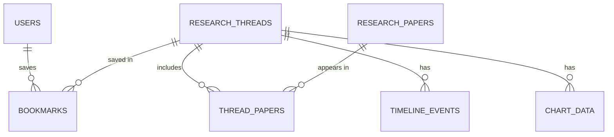

# AstroThread: Stage 3 Technical Documentation

## 1. User stories

AstroThread is a website for exploring astronomy and physics research through connected threads. The stories below are ranked with MoSCoW; Must and Should stories form the MVP.

| Priority | User type | Story |
| --- | --- | --- |
| Must | Visitor | I want to register and log in, so that my bookmarks and profile are saved. |
| Must | Student | I want to browse and search research threads, so that I can explore scientific topics in an organized way. |
| Must | Student | I want to open a thread and see its overview and related papers, so that I can follow a topic from its origin to recent work. |
| Must | Student | I want to view a timeline of discoveries, so that I can understand how a scientific idea developed over time. |
| Must | Student | I want to see astronomy images and data from NASA linked to a topic, so that the content feels concrete. |
| Must | Researcher | I want to explore scientific data through interactive charts, so that I can understand it visually. |
| Must | Researcher | I want to ask an AI assistant about a research paper, so that I can understand complex scientific information more easily. |
| Should | Student | I want to filter threads by category (for example black holes or exoplanets), so that I can find topics that interest me. |
| Should | Researcher | I want to see related papers and their authors, so that a thread connects to real scientific sources. |
| Should | Student | I want to bookmark threads and see them on my profile, so that I can return to them quickly. |
| Could | Student | I want to try an interactive simulation of an astronomy or physics concept, so that I can learn by experimenting. |
| Could | Student | I want a daily learning streak, so that I stay motivated to come back. |
| Won't | All users | Users cannot edit or modify research data; all research content is read-only. |

## 2. Mockups

The website has six web pages; the timeline and NASA media are panels inside Thread Details, not separate pages. Every page shares the same navbar and footer.

| Page or panel | Type | Contents |
| --- | --- | --- |
| Home | Page | Navbar, search bar, featured thread cards. |
| Research Threads | Page | Search with category filters and a grid of thread cards with bookmark icons. |
| Thread Details | Page | Overview, Timeline and Related Papers tabs, plus the NASA media panel. |
| Research Timeline | Panel in Thread Details | Vertical timeline: year, event, description. |
| NASA Media Panel | Panel in Thread Details | Image and data cards tied to the thread's topic. |
| Data Visualization | Page | Chart with basic controls (dropdown and slider). |
| AI Research Assistant | Page | Chat interface for asking questions about a research paper retrieved from OpenAlex. |
| Login / Sign Up | Page | Centered form with email and password, with a switch between login and registration. |
| Profile | Page | User details and bookmarked threads. |

Pages that depend on NASA, OpenAlex or the AI provider also need loading, error and empty states, because an external API can be slow or fail.

## 3. System architecture

AstroThread has four layers: a React frontend, a Flask REST API, a PostgreSQL database and three external APIs. The browser talks only to the frontend, and only the backend talks to the database and the external APIs.

### 3.1 Frontend (React website)

| Part | Contents |
| --- | --- |
| Web pages | Home, Research Threads, Thread Details, Data Visualization, AI Assistant, Login and Profile. |
| UI components | Navbar, search bar, category chips, thread cards, tabs, timeline items, chart cards, NASA media cards, chat bubbles. |
| State and routing | React Router for navigation; authentication state that holds the logged-in user and the JWT. |
| API client | Sends every request to the backend as JSON and attaches the JWT to protected requests. |

### 3.2 Backend (Python / Flask REST API)

Every request passes through the middleware, then reaches one feature module, which uses the data access layer.

| Part | Item | Responsibility |
| --- | --- | --- |
| Middleware | Auth check (JWT) | Verifies the token on protected routes. |
| Middleware | Request validation | Rejects missing or malformed input. |
| Middleware | Error handling | Returns errors as JSON with the right HTTP status. |
| Feature module | Auth | Registration, login, password hashing, issuing the JWT. |
| Feature module | Users | Profile data. |
| Feature module | Threads | Listing, searching and filtering threads; featured threads. |
| Feature module | Papers | Related papers for a thread. |
| Feature module | Timeline | Timeline events by year for a thread. |
| Feature module | Visualization | Chart datasets. |
| Feature module | AI assistant | Retrieves a paper and returns an explanation. |
| Feature module | Bookmarks | Saving and removing bookmarked threads. |
| Data access | Database queries | Reads and writes PostgreSQL. |
| Data access | API clients with caching | Call NASA, OpenAlex and the AI provider; cache responses to reduce repeated calls. |

### 3.3 External APIs

| API | Supplies | Used by |
| --- | --- | --- |
| NASA APIs | Astronomy images and scientific data. | Threads (media panel), Visualization. |
| OpenAlex API | Research papers, authors and metadata. | Papers, AI assistant. |
| AI provider API | Summaries and explanations of papers. | AI assistant. |

## 4. Database design (PostgreSQL)

The database has seven tables, with research threads at the centre. PK is a primary key, FK a foreign key and UK a unique value.

| Table | Columns | Purpose |
| --- | --- | --- |
| users | id (PK), name, email (UK), password_hash, created_at | Registered accounts. |
| research_threads | id (PK), title, category, summary, is_featured, created_at | The threads users browse. |
| research_papers | id (PK), openalex_id (UK), title, authors, publication_year, abstract, url | Papers retrieved from OpenAlex. |
| thread_papers | thread_id (PK, FK), paper_id (PK, FK) | Links papers to threads. |
| timeline_events | id (PK), thread_id (FK), year, title, description | Events shown on a thread's timeline. |
| chart_data | id (PK), thread_id (FK), title, chart_type, dataset (JSONB) | Datasets for the charts. |
| bookmarks | id (PK), user_id (FK), thread_id (FK), created_at | Threads a user saved. |

### Relationships

| From | To | Type | Meaning |
| --- | --- | --- | --- |
| research_threads | timeline_events | One to many | A thread has many timeline events. |
| research_threads | chart_data | One to many | A thread has many chart datasets. |
| research_threads | research_papers | Many to many, through thread_papers | A thread includes many papers, and a paper can appear in several threads. |
| users | research_threads | Many to many, through bookmarks | A user saves many threads, and a thread can be saved by many users. |

## 5. System flow

Every request follows the same path: the user acts in the browser, the React frontend calls the Flask REST API over HTTPS with JSON, and the API returns JSON. The five flows below differ only in what the backend does.

### 5.1 Standard request (threads, timeline, charts, bookmarks)

1. The user opens a page or performs an action in the React frontend.
2. The API client sends the request to the Flask REST API, with the JWT if the route is protected.
3. The middleware checks the token and validates the input.
4. The feature module queries PostgreSQL through the data access layer.
5. The API returns JSON and the frontend renders the result.

### 5.2 Authentication

1. The user submits the login or sign-up form.
2. The frontend sends the email and password to the Flask REST API.
3. The Auth module verifies the credentials against the users table (or creates the user with a hashed password) and issues a JWT.
4. The frontend stores the token and sends it with future requests.

### 5.3 NASA data request

1. The user opens a thread or a chart that needs NASA content.
2. The frontend sends the request to the Flask REST API.
3. The NASA API client returns the cached response if one exists; otherwise it calls the NASA API and caches the result.
4. The API returns the images or data and the frontend displays them.

### 5.4 OpenAlex research request

1. The user opens the Related Papers tab or searches for papers.
2. The frontend sends the request to the Flask REST API.
3. The OpenAlex API client retrieves the papers and their metadata, using the cache when possible.
4. The Papers module saves the papers in research_papers and links them to the thread in thread_papers.
5. The API returns the papers and the frontend displays them.

### 5.5 AI explanation request

1. The user selects a paper and asks a question in the AI Assistant.
2. The frontend sends the paper and the question to the Flask REST API.
3. The AI assistant module loads the paper from research_papers, or retrieves it from the OpenAlex API if it is not stored.
4. The module sends the paper and the question to the AI provider API.
5. The API returns the explanation and the frontend shows it in the chat.

If an external API fails or times out, the backend returns a JSON error and the frontend shows the page's error state.

## 6. After the MVP

Three features are deferred so the MVP fits the three-month schedule.

| Feature | Why it is deferred |
| --- | --- |
| Interactive simulation | The most complex feature to build; it runs in the browser and does not block any other page. |
| arXiv papers | OpenAlex already supplies papers and metadata for the MVP. |
| Learning streak | Needs activity tracking that no MVP page depends on. |
